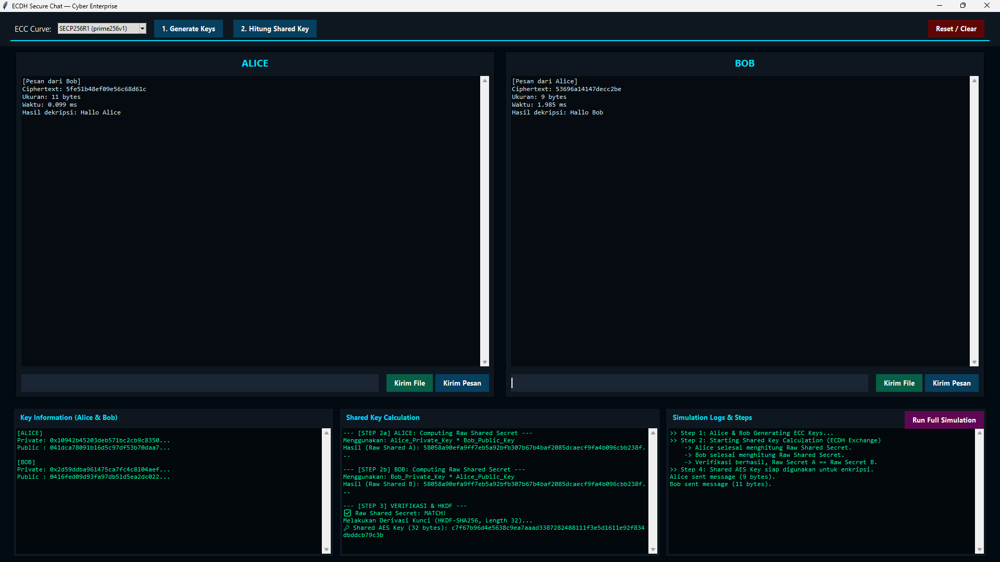

# 🔐 ECC Key Exchange Simulation (ECDH Secure Chat)

A Python-based cryptography project that demonstrates **Elliptic Curve Cryptography (ECC)** for secure key exchange using the **Elliptic Curve Diffie–Hellman (ECDH)** protocol.  
This project simulates a secure communication scenario between **Alice** and **Bob**, including shared key derivation and AES-based message encryption.

---

## 📌 Project Overview

This project was developed as part of a **Cryptography course (Semester 5)** to demonstrate:

- Secure key exchange using **ECC (Elliptic Curve Cryptography)**
- Shared secret generation using **ECDH**
- Symmetric encryption using **AES**
- A GUI-based simulation of secure communication (Alice ↔ Bob)

The application allows users to visualize each cryptographic step, including key generation, shared secret computation, and encrypted message transfer.

---

## 🎯 Objectives

- Implement ECC-based key exchange (ECDH)
- Prove that both parties obtain the **same shared secret**
- Encrypt and decrypt messages securely using derived keys
- Demonstrate ECC advantages over traditional cryptography (e.g., RSA)

---

## 🧠 Cryptography Concepts Used

- **Elliptic Curve Cryptography (ECC)**
- **ECDH (Elliptic Curve Diffie–Hellman)**
- **HKDF (Key Derivation Function – SHA-256)**
- **AES (Advanced Encryption Standard)**

**ECC Curve Used:**  
`secp256r1 (prime256v1)`

---

## 🖥️ Application Features

✅ ECC key pair generation for Alice and Bob  
✅ Shared secret computation and verification  
✅ AES key derivation using HKDF  
✅ Secure message & file encryption  
✅ GUI-based secure chat simulation  
✅ Detailed simulation logs and steps  

---

## 📷 Application Preview

> Example of the ECC Secure Chat Simulation Interface:

---

## 🗂️ Project Structure

